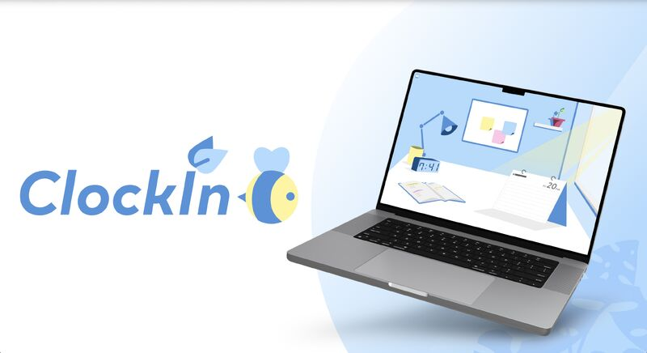
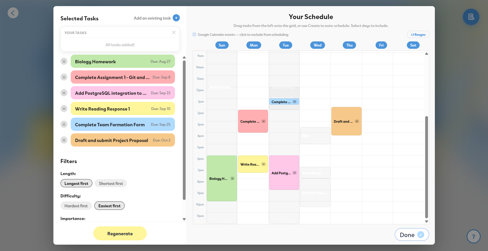
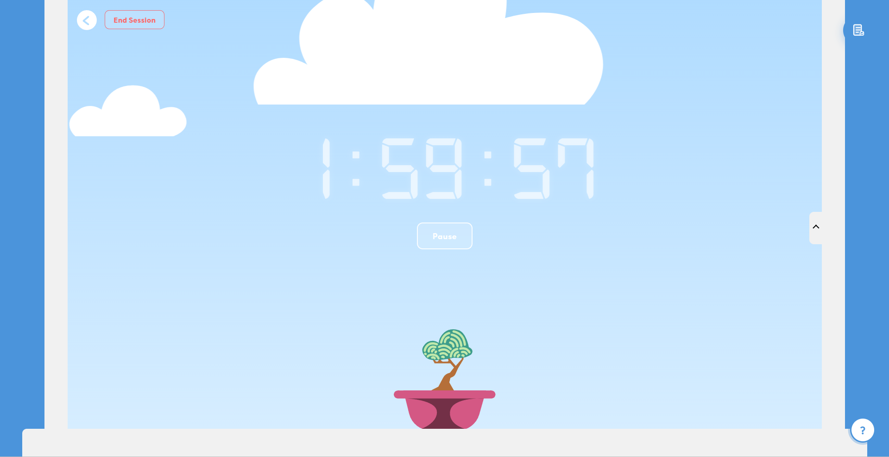
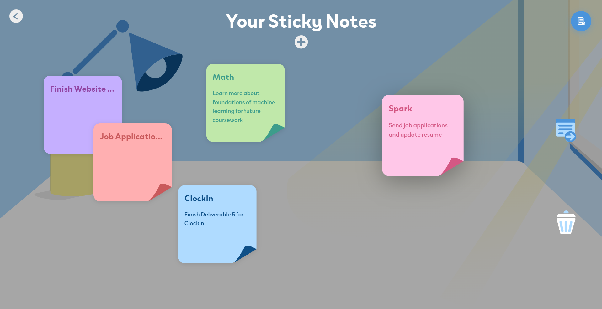
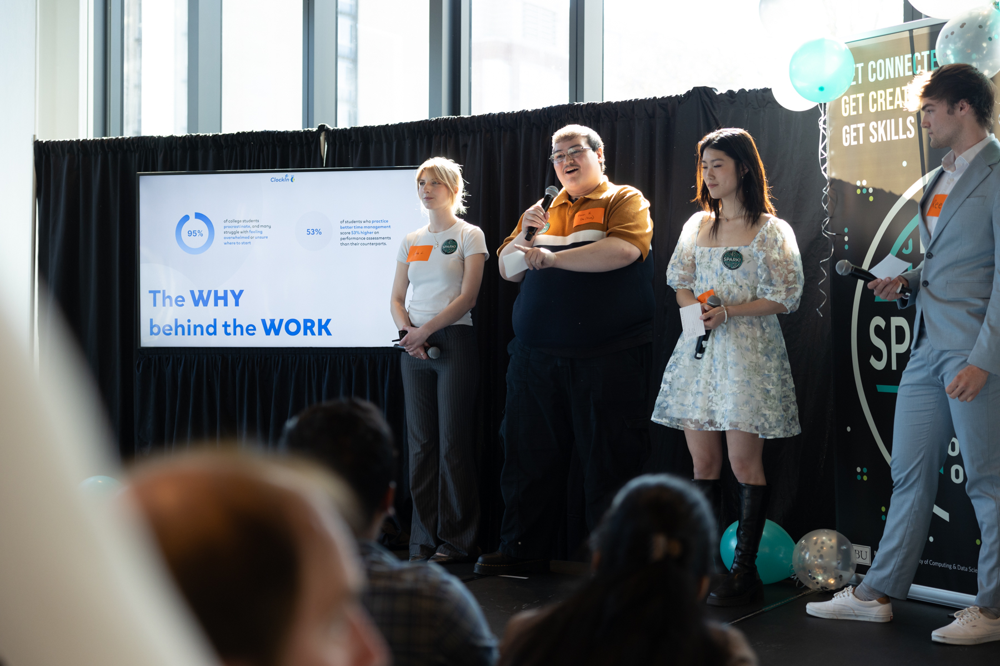

# ClockIn Study Hub

> Plan your work. Focus your time. Grow your progress.

ClockIn is a full-stack productivity platform that transforms assignments and
user input into structured study plans. It combines intelligent task
prioritization, calendar availability, focus tracking, and progress rewards
within one application.

ClockIn was developed by a cross-functional team through the Boston University
Spark! Innovation Fellowship.

<p align="center">
  
</p>

## Project Links

- [Open the Live Application](https://clock-in-orcin.vercel.app/)
- [Read the ClockIn Case Study](https://medium.com/@clewis27/clockin-b98a8865dab4)

> **Project status:** Active feature development has concluded, but the project
> remains maintained and available as a functional demonstration.

## Application Preview

<p align="center">
  
  
</p>

<p align="center">
  
  
</p>

> **Screens shown:** Intelligent study scheduler, focus timer, progress garden,
> and task-convertible sticky notes.

## Features

- **Intelligent study planning** — prioritizes tasks using deadlines,
  importance, estimated completion time, and user-defined value.
- **AI-assisted task creation** — converts uploaded assignment information into
  structured, actionable tasks.
- **Google Calendar integration** — considers existing calendar events and
  availability when organizing study time.
- **Focus timer** — tracks active and paused study sessions while protecting
  against abandoned or stale sessions.
- **Sticky notes** — allows users to quickly record ideas and convert notes into
  scheduled tasks.
- **Progress garden** — rewards completed focus time with plants that visually
  represent the user’s progress.
- **Persistent accounts** — stores tasks, schedules, statistics, focus sessions,
  and completed plants through Supabase.
- **Responsive interface** — supports productivity workflows across desktop and
  mobile screen sizes.

## Technical Highlights

- **Batched timer synchronization** — reduced repeated backend requests by
  approximately 97% by batching focus-time updates instead of writing to the
  backend on every timer tick.
- **Planner prioritization** — scores tasks using deadlines, importance,
  estimated duration, and user value to produce an actionable daily plan.
- **Adaptive scheduling** — uses scheduling edits and completion behavior to
  better match future tasks with users’ preferred study times and working
  patterns.
- **AI task pipeline** — extracts assignment information from uploaded documents
  and converts larger assignments into smaller, actionable tasks.
- **Calendar-aware planning** — combines Google Calendar events with manually
  entered busy times when determining user availability.
- **Layered backend design** — separates FastAPI controllers, services, and
  database operations to keep application behavior maintainable.
- **Persistent timer state** — maintains active and paused sessions while
  detecting sessions left open beyond the allowed duration.

## Architecture

ClockIn consists of three primary layers:

- The **React and TypeScript frontend** provides the planner, task management,
  timer, calendar, statistics, and garden interfaces.
- The **FastAPI backend** processes application logic and coordinates requests
  between the frontend, external services, and persistent data.
- **Supabase/PostgreSQL** manages authentication and stores user tasks, calendar
  information, timer sessions, statistics, and completed plants.

ClockIn also integrates with the **Google Calendar API** for availability data
and the **OpenAI API** for AI-assisted task creation.

## 🛠 Tech Stack

### Frontend

- React
- TypeScript
- Vite
- DND Kit
- HTML/CSS

### Backend

- Python
- FastAPI
- Uvicorn

### Database and Services

- Supabase
- PostgreSQL
- Supabase Authentication
- Google Calendar API
- OpenAI API

### Deployment

- Vercel — frontend hosting
- Railway — backend hosting

## Team and Contributions

ClockIn was developed by a four-person cross-functional team. The team
collaborated across product planning, system design, software development,
testing, user research, and UI/UX design.

<p align="center">
  
</p>

<p align="center">
  <em>The ClockIn team presenting the project at Boston University Spark! Demo Day.</em>
</p>

- **Kevin Kupeli** — Developed the task page, note-to-task conversion pipeline,
  task atomization, and onboarding experience; contributed to overall OpenAI model
  integration and served as Product Owner.
- **Reese Stichter** — Developed sticky notes, the progress garden, focus timer,
  and Google Calendar integration; contributed to overall system design and
  served as Scrum lead.
- **Alicia Lin** — Developed the scheduling and learning pipelines, dark mode,
  and user authentication.
- **Clara Lewis** — Created application assets, typography, color system, and
  visual branding.

## Product Development

The team used Agile development practices to plan, prioritize, and deliver
ClockIn across multiple development sprints.

- Conducted more than 30 user interviews to understand student productivity
  challenges.
- Prioritized functionality using user value, development effort, and project
  requirements.
- Converted product requirements into user stories and scoped sprint
  deliverables.
- Collaborated across technical and UI/UX roles to translate designs into
  reusable application components.

## 🚀 Local Development

### Requirements

- Node.js and npm
- Python 3.11+
- A Supabase project

### Clone the Repository

```bash
git clone https://github.com/reesestic/ClockIn.git
cd ClockIn
```

Copy `backend/.env.example` to `backend/.env` and add the required Supabase and
API configuration values.

### Frontend Setup

```bash
cd frontend
npm install
npm run dev
```

The frontend runs at [http://localhost:5173](http://localhost:5173).

### Backend Setup

From a separate terminal:

```bash
cd backend
python -m venv venv
```

Activate the virtual environment:

```bash
# macOS/Linux
source venv/bin/activate

# Windows PowerShell
.\venv\Scripts\Activate.ps1
```

Install the dependencies and start the API:

```bash
pip install -r requirements.txt
uvicorn main:app --reload
```

The backend runs at [http://127.0.0.1:8000](http://127.0.0.1:8000).

> **Important:** Both development servers must be running for full application
> functionality.

## License

This project is available under the [MIT License](LICENSE).
